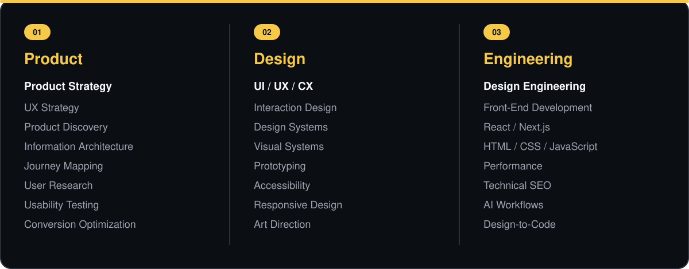

<!--
==============================================================
 SAMER TALLAUZE — GITHUB PROFILE
 Product Design × Engineering × Strategy × Growth

 Brand Direction
 Background     #0B0F14
 Surface        #11161D
 Brand Yellow   #F7C948
 Primary Text   #F5F7FA
 Secondary      #9CA3AF
 Border         #2B3038
==============================================================
-->

 

<strong>ST · PRODUCT DESIGN & ENGINEERING</strong>

# Samer Tallauze

### Lead Product Designer & Developer

<strong>Complex Product Strategy · Design Systems · Design Engineering</strong>

 

I help teams turn ambiguity into <strong>clear product strategy, scalable design systems, 
and digital experiences that deliver measurable outcomes.</strong>

 

  

&nbsp;

&nbsp;

&nbsp;

  

&nbsp;

&nbsp;

  

---

## About

I'm a multidisciplinary **Lead Product Designer and Design Engineer** working at the intersection of product strategy, **UI/UX/CX**, design systems, front-end engineering, SEO, AI-assisted workflows, and product leadership.

For more than **16 years**, I've worked across the full product journey, from **discovery and UX strategy** to polished interfaces, scalable design systems, front-end implementation, optimization, and growth.

My strength is connecting disciplines that are often separated:

> **Business Strategy → Product Thinking → UX → UI → Engineering → Growth**

I think in systems, design around real human needs, and stay close enough to engineering to help ensure that the shipped experience preserves the original product intent.

---

## Core Capabilities

  

---

## Where I Create Value

<table>

<tr>

<td width="50%" valign="top">

<h3>Product Strategy</h3>

Turning ambiguous business problems into clear product direction, priorities, flows, and measurable outcomes.

</td>

<td width="50%" valign="top">

<h3>UX & Product Design</h3>

Designing intuitive journeys that reduce friction, improve comprehension, and move users confidently toward their goals.

</td>

</tr>

<tr>

<td width="50%" valign="top">

<h3>Design Systems</h3>

Creating scalable component, token, pattern, and governance systems that improve consistency and design-to-development velocity.

</td>

<td width="50%" valign="top">

<h3>Design Engineering</h3>

Closing the gap between design intent and shipped quality through strong front-end and implementation fluency.

</td>

</tr>

<tr>

<td width="50%" valign="top">

<h3>Growth & Optimization</h3>

Connecting UX, performance, SEO, accessibility, analytics, and conversion thinking to product growth.

</td>

<td width="50%" valign="top">

<h3>Leadership</h3>

Aligning design, product, engineering, research, commercial teams, and stakeholders around shared product outcomes.

</td>

</tr>

</table>

---

## Featured Work

### Flagship Product Case Studies

A selection of product engagements spanning **Fintech, Commerce, SaaS, Healthcare, and complex digital platforms**.

| Product | Domain | Product Focus | Representative Outcome |
| :--- | :--- | :--- | :--- |
| **[Aurora — Mobile Banking Super-App](https://samertall.com/case-studies/aurora-mobile-banking-super-app/)** | Fintech | Mobile UX · Design System · Accessibility | **+40% Activation** |
| **[Souq Lane — Marketplace Platform](https://samertall.com/case-studies/souq-lane-marketplace-platform/)** | Commerce | Discovery · Checkout · CRO | **+25% Conversion** |
| **[Pulse — Realtime Analytics Suite](https://samertall.com/case-studies/pulse-realtime-analytics-suite/)** | SaaS / Analytics | Data UX · Dashboard · Design System | **3× Faster Insights** |
| **[Medora — Care Management System](https://samertall.com/case-studies/medora-care-management-system/)** | Healthcare | Clinical UX · Workflow Design | **−60% Admin Time** |

 

Representative reconstructions of confidential shipped work. Product names and visuals may be altered; outcome figures are rounded and permission-safe. Full context is provided within each case study.

---

## Leadership & Systems

I don't see product design as screen production. My role is to create the **conditions in which strong product decisions can consistently happen**.

<table>

<tr>

<td width="50%" valign="top">

<h3>Multidisciplinary Leadership</h3>

Aligning designers, researchers, product managers, engineers, and commercial stakeholders around one product direction.

</td>

<td width="50%" valign="top">

<h3>Stakeholder Alignment</h3>

Turning competing priorities and complex requirements into understandable decisions and sequenced roadmaps.

</td>

</tr>

<tr>

<td width="50%" valign="top">

<h3>Design System Governance</h3>

Building reusable systems with clear patterns, tokens, contribution models, documentation, and governance.

</td>

<td width="50%" valign="top">

<h3>Outcome Ownership</h3>

Connecting design decisions with usability, conversion, adoption, retention, performance, and business outcomes.

</td>

</tr>

</table>

---

## My Product Process

<table>

<tr>

<td align="center" width="25%" valign="top">

<h2>01</h2>

<strong>DISCOVER</strong>

  

Research users, business goals, data, constraints, market context, and opportunities.

</td>

<td align="center" width="25%" valign="top">

<h2>02</h2>

<strong>DEFINE</strong>

  

Transform ambiguity into strategy, architecture, priorities, journeys, and product decisions.

</td>

<td align="center" width="25%" valign="top">

<h2>03</h2>

<strong>DESIGN</strong>

  

Create prototypes, interfaces, systems, interaction models, and scalable experiences.

</td>

<td align="center" width="25%" valign="top">

<h2>04</h2>

<strong>DELIVER</strong>

  

Partner with engineering, validate quality, measure outcomes, learn, and continuously optimize.

</td>

</tr>

</table>

---

## Toolbox

### Product & Design

### Engineering

### Growth & Intelligence

---

# GitHub

I use GitHub as part of my product-building workflow: prototyping ideas, exploring front-end technology, testing AI-assisted workflows, building digital products, and connecting **design intent with working software**.

---

## Professional Impact

&nbsp;

&nbsp;

---

## GitHub Stats

---

## Contribution Activity

---

## Most Used Languages

Repository language statistics reflect public GitHub code and do not represent my complete professional technology stack.

---

## Product Philosophy

### Good design makes complexity feel simple.

Great products emerge when **user needs, business strategy, design, 
engineering, and growth operate as one connected system.**

 

**Driven by impact. Grounded in empathy. Built for scale.**

---

## Let's Build Something Meaningful

Whether you're hiring a <strong>product design leader</strong> or looking for someone who can move from strategy to design and implementation, I'd be happy to connect.

  

&nbsp;

&nbsp;

&nbsp;

   

### Product Design × Engineering × Strategy × Growth

Designed & built with 💛 by Samer Tallauze

  

<a href="https://samertall.com/">
<strong>samertall.com</strong>
</a>

